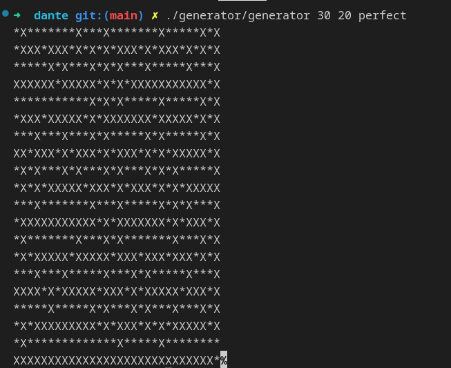
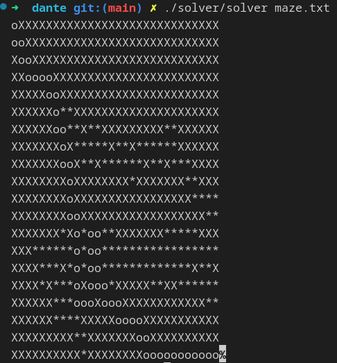

# DANTE

The Dante is a C algorithmic project that was done in groups of two over a period of three weeks.

It consisted on the one hand in randomly generating perfect or imperfect mazes that contained "*" as possible paths and "X" that represented obstacles.

And on the other hand it consisted in finding the fastest path from the top left to the bottom right to solve the created mazes as quickly as possible. Once the path is found, it is represented by "o" in the maze. In order for the maze to be solvable, there must not be a "\n" at the end of the maze.

## Installation and usage

To use it, follow the instructions below: Clone the repository by entering the following command in your terminal:

    git clone git@github.com:Patricklevyy/dante.git

Access the cloned folder and compile the project by entering the command:

    make re

Run the program by entering the command:

In order to generate a perfect maze you need to run the program as :

    ./generator/generator x y perfect

The x represents the width, y the height and the "perfect" to specify that it is a perfect maze.

For example, if you want to generate a perfect maze of width 30 and height 20 you must type the command :

    ./generator/generator 30 20 perfect

And the result will be:

And then to be able to generate an imperfect maze you have to run the program in the form:

    ./ generator/ generator x y

It's the same as the generation of the imperfect labyrinth but this time without the "perfect". So to generate an imperfect labyrinth of width 30 and height 20 you must do the following:

    ./generator/generator 30 20

And the result will be:

After generating the maze we have to solve it and to do it when we generate it we have to redirect it to a text file for example

    ./generator/generator 30 20 > maze.txt

By doing this we have a file called maze.txt which contains the labirynth that is created.

Once the file is created you just have to write in the terminal:

    ./solver/solver maze.txt

In case you didn't call the file that contains the labirynthe maze.txt you just have to change the name in the command.

So for the resolution of the labyrinth of width 30 and height 20 we get as result :

 

## Contact

If you have any questions or comments, you can contact us at: gnanmienlie-patrick-levy.n-da@epitech.eu or axel.petitjean@epitech.eu.
